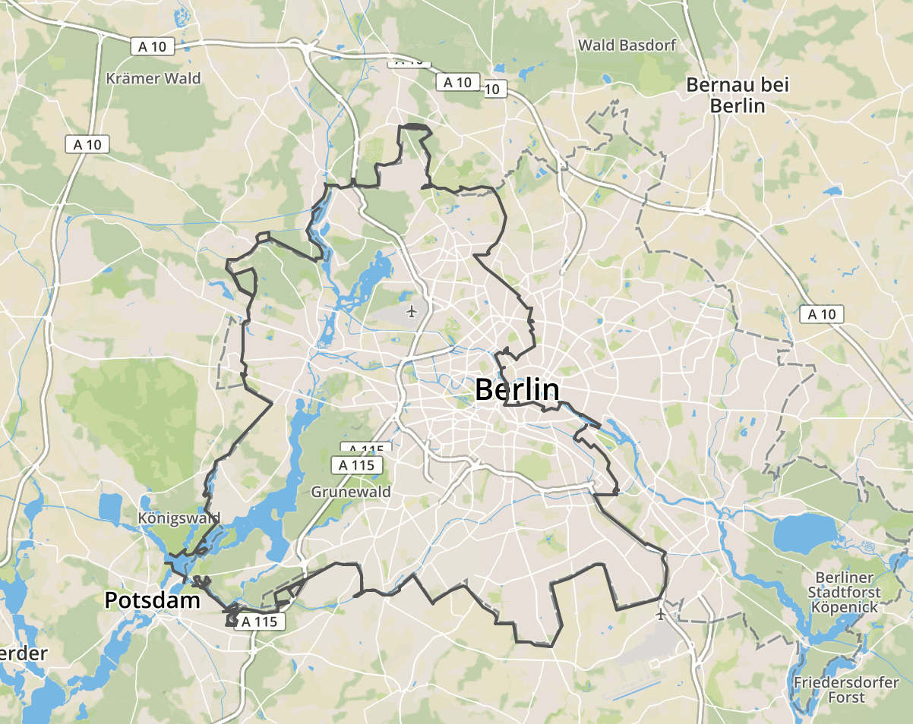

# berlin-wall-shape

**The [Berlin Wall (Berliner Mauer)](https://en.wikipedia.org/wiki/Berlin_Wall) as GeoJSON.** Taken [from the open data portal of Berlin](https://daten.berlin.de/datensaetze/verlauf-der-berliner-mauer-1989-hinterlandmauer-wfs).

[see a live map](https://fbinter.stadt-berlin.de/fb/index.jsp?loginkey=zoomStart&mapId=k_mauer@senstadt&bbox=18997,17259,31668,24771)

[](https://www.npmjs.com/package/berlin-wall-shape)
[](https://travis-ci.org/derhuerst/berlin-wall-shape)
[](https://gitter.im/derhuerst)

[](https://bl.ocks.org/d/a9bca806db0f41216dc3ebfbd84cd023)


## Installing

```shell
npm install berlin-wall-shape
```


## Usage

```js
const shape = require('berlin-wall-shape')
console.log(shape)
```

`shape` will be a [GeoJSON](http://geojson.org/) [`MultiLineString`](https://tools.ietf.org/html/rfc7946#section-3.1.5).

```js
{
	type: 'MultiLineString',
	coordinates: [
		[
			[13.204769, 52.616444],
			[13.208006, 52.617655],
			// …
		],
		[
			[13.292293, 52.661454],
			[13.295914, 52.66113],
			// …
		],
		// …
	]
}
```


## License

The [underlying data](https://daten.berlin.de/datensaetze/verlauf-der-berliner-mauer-1989-hinterlandmauer-wfs) is licensed under the proprietary [*Geodatennutzungsverordnung*](license.md).


## Contributing

If you have a question or have difficulties using `berlin-wall-shape`, please double-check your code and setup first. If you think you have found a bug or want to propose a feature, refer to [the issues page](https://github.com/derhuerst/berlin-wall-shape/issues).
